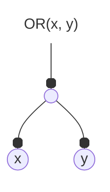
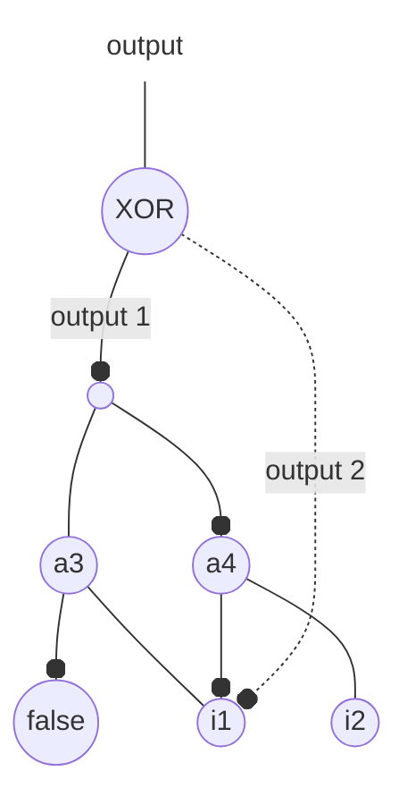

> [!note] Context
> I'm writing this blog post after reading Tom Scheers's post [Writing memory efficient C structs](https://tomscheers.github.io/2025/07/29/writing-memory-efficient-structs-post.html) which covers the memory layout of structs and techniques such as bitfields. Today, we will look at another technique which can be used to save memory, and also enable a more natural representation of certain data structures.

Let's talk about _tagged pointers_.

# Understanding tagged pointers

Tagged pointers are using memory alignment to store additional information.

If on a given architecture `int` is 4 bytes, then `int` values have to be 4-byte aligned (_edit: [[tagged-pointers#Edit on alignment|this assumption is false in general]]_). As the addresses of these values must be a multiple of 4, pointers to such values must necessarily have their two least significant bits set to 0 (if those bits were not 0, the address wouldn't be a multiple of 4).

```c
// assuming sizeof(int) = 4 on the current architecture
int x; // x must be 4-byte aligned
int *p = &x; // p is pointing to a memory address which is a multiple of 4
// p = 0b........00 : the two least significant bits must be 0 for the address
```

![[memory.png]]

The idea of tagged pointers is to use these two bits to store information. This will corrupt the pointer, but we know how to retrieve the valid pointer from a corrupted one (we simply set these bits to 0). Looking at the diagram above, if a pointer points to `0x7`, we know that this isn't a valid address for `x`, so we are able to infer that `x` actually starts at `0x4`.

Now instead of an `int`, you might have a pointer to any data type, whose memory alignment might be larger (and thus allow to use more bits as tags for additional information). In practice, implementing tagged pointers requires to be careful about the specific architecture you are targeting.

Let's take a real example with the And Inverter Graph (AIG) data structure.

# Real-world use case of tagged pointers : AIG

This example is taken from the source code of the [ABC](https://github.com/berkeley-abc/abc) project, a software performing various operations to design chips.

The source code presented in this section is [available on github](https://gist.github.com/remigerme/18bb9e783a0eb688d464e4b008ce80f4).

## And Inverter Graphs (AIGs)

And Inverter Graphs (AIGs) are used to represent boolean circuits. They are graphs consisting of inputs, and `AND` gates with two incoming wires (called _fanins_). Moreover, wires can be complemented using `NOT` gates.

With `AND` and `NOT` gates, we can recreate every combinational logic we want. For example:

$$
\mathtt{OR(x, y) = NOT(AND[NOT(x), NOT(y)])}
$$

And the corresponding AIG will be (`x` and `y` are inputs, the unlabeled node is an `AND` gate, and black dots on edges represent a `NOT` gate):



AIGs have been studied extensively[^2], and are used in electronic design automation (EDA) software, that is, software to design electronic chips.

### Edges must be complemented, not nodes

This section can be safely skipped. It justifies the need of having complementable edges (_i.e._ edges that carry `NOT` gates rather than `NOT` gates as nodes directly[^3]).

Why not simply complement the nodes themselves you may ask? Well, this would have worked if AIGs were trees, but they are **directed** acyclic graphs (DAG) whereas trees are **undirected** acyclic graphs[^1]. Intuitively, in a tree, nodes have exactly one parent (except the root which has no parent), whereas in an AIG, nodes might have multiple parents.

For example, in the following construct (called a _miter_), node `i1` is used by `a3` (uncomplemented edge) and `a4` (complemented edge).



So, it's really the edges that might be complemented, not the nodes themselves.

> [!info]- Self-promotion (click to unfold)
> Want to get a better understanding on what's going on here and why is it used for? Take a look at the README of the [AIG library](https://github.com/remigerme/mutaig) I'm building in Rust. I'll maybe do a blog post on functional equivalence checking later, but if you are interested the [docs](https://docs.rs/mutaig/latest/mutaig/) of the library should hopefully provide some explanations.

## A naive implementation without tagged pointers

In this first implementation, an `AigEdge` struct was created to carry the complement of an edge.

```c
typedef enum AigNodeType_ AigNodeType;
typedef struct AigEdge_ AigEdge;
typedef struct AigNode_ AigNode;

enum AigNodeType_ {
	False,
	Input,
	And
};

struct AigEdge_ {
	AigNode *node;
	unsigned int complement : 1;
};

struct AigNode_ {
	unsigned int id;
	AigNodeType type : 2;
	AigEdge *fanin0;
	AigEdge *fanin1;
};

unsigned int is_complemented(AigEdge *p) {
	return p->complement;
}
```

The complement is just a boolean, so it is possible to store it in only one bit, and store that bit directly in the fanin pointer instead.

## Representing AIG with tagged pointers

Let's use the least significant bit of the pointers to `AigNode` to store the value of `complement`.

```c
#include <inttypes.h>

typedef enum AigNodeType_ AigNodeType;
typedef struct AigNode_ AigNode;

enum AigNodeType_ {
	False,
	Input,
	And
};

struct AigNode_ {
	unsigned int id;
	AigNodeType type : 2;
	AigNode *fanin0;
	AigNode *fanin1;
};

// Use this to access the valid underlying pointer (with LSB set to 0)
static inline AigNode *regular_node(AigNode *p) {
	return (AigNode *)((uint64_t)p & ~1);
}

// Use this to create a complemented edge (with LSB set to 1)
static inline AigNode *complemented_node(AigNode *p) {
	return (AigNode *)((uint64_t)p | 1);
}

static inline unsigned int is_complemented(AigNode *p) {
	// Just checking for the least significant bit
	return (unsigned int)((uint64_t)p & 1);
}
```

This is actually (a very simplified version of) the [implementation provided by ABC](https://github.com/berkeley-abc/abc/blob/master/src/aig/aig/aig.h).

Now, `AigEdge` has completely disappeared, removing one layer of indirection. We just need to be careful when using the fanins, as they might be invalid pointers. For example, to access the `id` of a fanin:

```c
unsigned int get_fanin0_id(AigNode *p) {
	// Do not do this: p->fanin0 might not be a valid pointer.
	// return p->fanin0->id;

	// Access the regular pointer instead:
	return regular_node(p->fanin0)->id;
}
```

Note that we need to perform some casts to avoid the compiler yelling at us. Once again, these casts are architecture-dependent.

# Digression on representable states

One big problem with both of the codes shown above is that they allow representation of AIGs in an **invalid state** :

- `AND` nodes are expected to have two fanins, but that might not be the case
- inputs are not supposed to have any fanin, but that might not be the case
- a node might have an invalid type
- ...

So many things could go wrong.

Rust enum really shines there, allowing to represent (almost) only valid states (not using tagged pointers in the code below):

```rust
struct AigEdge {
	// Rust forces us to use reference counters,
	// which we need to do in the C implementation anyway
	node: Rc<RefCell<AigNode>>,
	complement: bool,
}

enum AigNode {
	False,
	Input(u32),
	And {
		id: u32,
		fanin0: AigEdge,
		fanin1: AigEdge,
	},
}
```

This way, the integrity of the AIG is statically guaranteed!

_(This is a lie, because the integrity of the AIG is more than just some requirements about individual nodes. An AIG must not contain any cycle, which is a property we must check at the AIG scale and not only at each node separately. But there are still less things that could go wrong.)_

---

# Edit on alignment

> [!quote] Assumption made earlier
> If on a given architecture `int` is 4 bytes, then `int` values have to be 4-byte aligned.

As pointed out by commenters on [reddit](https://www.reddit.com/r/C_Programming/comments/1mh5ree/tagged_pointers_in_action/) (thanks for pointing out my mistake!), this assumption is false in general. In order to obtain guarantees on alignment, we have two strategies:

- using `__attribute__((aligned(...)))` from GCC extensions[^5]
- using `alignas(...)` starting from C11[^4].

**Using variable attribute from GCC.**  
We can simply define an alias to an aligned int, and use this alias in the rest of the codebase.

```c
typedef __attribute__((aligned(4))) int aligned4_int;
```

**Using `alignas` (>=C11).**  
Unlike the previous solution, `alignas` cannot be applied to type definitions directly.

```c
#include <stdalign.h>

typedef alignas(4) int aligned4_int;

// will result in the following error
tagged.c:15:9: error: '_Alignas' attribute only applies to variables and fields
   15 | typedef alignas(4) int aligned4_int;
```

However, we can wrap an aligned `int` inside a struct (thus forcing the alignment of the struct).

```c
#include <stdalign.h>

typedef struct {
	alignas(4) int inner;
} aligned_int;
```

This approach has the downside of adding one level of undirection, which might be quite painful in practice.

**On weakening alignment.**  
Note that `alignas` can only be used to provide a stricter alignment. Trying to provide a weaker alignment for an `int` will fail.

```c
typedef struct {
	alignas(2) int inner;
} aligned2_int;

// will result in the following error
tagged.c:12:5: error: requested alignment is less than minimum alignment of 4 for type 'int'
   12 |     alignas(2) int inner;
```

On the other hand, `__attribute__((aligned(...)))` is less restrictive and allows us to provide weaker alignments. The following works fine:

```c
typedef __attribute__((aligned(2))) int aligned2_int;

struct S {
	char u;
	char v;
	aligned2_int x;
	char y;
	char z;
};

int main() {
	assert(sizeof(struct S) == 8);
	assert(__alignof__(struct S) == 2);
	// Or even if using >=C11 and <stdalign.h>
	assert(alignof(struct S) == 2);
}
```

Leading to `struct S` being stored according to the memory layout below.

![[struct_layout.png]]

[^1]: Trees are undirected _connected_ acyclic graphs.

[^2]: Some references :

    - Mishchenko, A., Chatterjee, S., & Brayton, R. (2006, July). DAG-aware AIG rewriting a fresh look at combinational logic synthesis. In _Proceedings of the 43rd annual Design Automation Conference_ (pp. 532-535).
    - Bjesse, P., & Boralv, A. (2004, November). DAG-aware circuit compression for formal verification. In _IEEE/ACM International Conference on Computer Aided Design, 2004. ICCAD-2004._ (pp. 42-49). IEEE.
    - Mishchenko, A., Chatterjee, S., Brayton, R., & Een, N. (2006, November). Improvements to combinational equivalence checking. In _Proceedings of the 2006 IEEE/ACM international conference on Computer-aided design_ (pp. 836-843).

[^3]: I mean it would work to have `NOT` gates as nodes in the AIG, but it will require potentially twice as nodes as if `NOT` gates are carried by edges.

[^4]: See section 6.7.5 of the C11 standard for more information on `alignas`.

[^5]: Learn more on the [manual page](https://gcc.gnu.org/onlinedocs/gcc/Common-Variable-Attributes.html).
